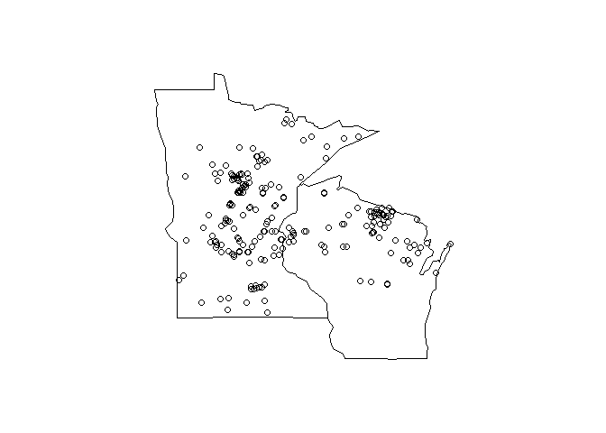

# README

Materials for manuscript describing drivers of Potamogeton species distribution in temperate lakes.  Potamegeton survey data were processed in `veg_analyses.rproj`.  All other data were created in this project with several processing scripts.  The data files can be recreated as follows:


```r
# process storet data, legacy and curent
source('R/storet_proc.R')

# supplement storet wq data with other sources
source('R/wq_proc.R')

# combine plant and covariate data for mn
source('R/mn_proc.R')

# combine plant and covariate data for wi
source('R/wi_proc.R')

# combine mn and wi data
source('R/combine.R')

# run models on combined ata
source('R/all_mods.R')
```

All figures and tables can be recreated as follows:


```r
source('R/figstabs.R')
```

## Data files

* `all_potam.RData` Combined and complete datasets for both MN and WI, contains lakes that have potamogetons and complete supporting data, created with `combine.R`

* `allmn_wq.RData` Combined legacy and recent STORET wq data for Minnesota lakes that I have aggregated across all dates, created in `storet_proc.R`, further modified in `wq_proc.r` to supplement missing data with DNR fisheries wq data

* `allwi_wq.RData` Combined legacy and recent STORET wq data for Wisconsin lakes that I have aggregated across all dates, created in `storet_proc.R`, further modified in `wq_proc.r` to supplement missing data with LTER WI data

* `legacy_wi_storet_keys.RData` spatial matches of legacy STORET stations and WBIC codes for Wisconsin, used to create wq data in `storet_proc.R`

* `mn_potam.RData` Minnesota data, frequency occurrence of potamogeton species and supporting data for each lake

* `mnmet_dat.RData` Old master dataset for Minnesota from dissertation 

* `new_wi_storet_keys.RData` spatial matches of recent STORET stations and WBIC codes for Wisconsin, used to create wq data in `storet_proc.R`

* `potam_PCNM.RData` PCNM results for Potamogeton lake locations, created in `all_mods.R`

* `spp_var.RData` variance partitioning by species, created in `all_mods.R`

* `spp_varmod.RData` individual local, climate, spatial models for each species, used for variance partitioning, created in `all_mods.R`

* `wi_potam.RData` Wisconsin data, frequency occurrence of potamogeton species and supporting data for each lake

* `wimet_dat.RData` Old master dataset for Wisconsin from dissertation

## Data description

Supporting data for each lake include morphometry, water quality, climate, and spatial variables:

* local (morphometry and wq): lake area (km2), perimeter (km), and max depth (m), alkalinity (mg/L CaCO3), water colour (Pt-Co units), secchi depth (m), and phosphorous (mg/L)

* climate:  annual mean temp (C), maximum temp of warmest month (C), minimum temp of coolest month (C), precip of driest month (mm), and altitude above sea level (m)

* spatial: PCNM eval of lat, long coordinates, only those with positive Moran values

## Data coverage

Not all data are complete for each dataset, mostly water quality data are missing:


```r
# MN
data(mn_potam)
dim(mn_potam)
```

```
## [1] 332  43
```

```r
dim(na.omit(mn_potam))
```

```
## [1] 146  43
```

```r
apply(mn_potam, 2, function(x) sum(is.na(x)))
```

```
##      lake  YYYYMMDD        PA        PC        PE        PF       PFL 
##         0         0         0         0         0         0         0 
##        PG        PI        PN        PO      POAL       POF      POFR 
##         0         0         0         0         0         0         0 
##       PON       POP      POPU       POR       POS      POSB      POSN 
##         0         0         0         0         0         0         0 
##       POV        PP        PR        PS        PV        PZ       tot 
##         0         0         0         0         0         0         0 
##     depth      area     perim    secchi     color       alk        tp 
##         5         0         0       133       174       158        49 
##  Latitude Longitude     tmean      tmax      tmin      prec       alt 
##         1         1         1         1         1         1         1 
##  optional 
##         1
```

```r
# WI
data(wi_potam)
dim(wi_potam)
```

```
## [1] 189  43
```

```r
dim(na.omit(wi_potam))
```

```
## [1] 78 43
```

```r
apply(wi_potam, 2, function(x) sum(is.na(x)))
```

```
##      lake  YYYYMMDD        PA        PC        PD        PE        PF 
##         0         0         0         0         0         0         0 
##        PG        PI        PN        PO      POAL       POB      POFR 
##         0         0         0         0         0         0         0 
##       PON       POO       POP      POPU       POR       POS      POSB 
##         0         0         0         0         0         0         0 
##      POSN       POV        PP        PR        PS        PZ       tot 
##         0         0         0         0         0         0         0 
##      area     depth     perim    secchi     color       alk        tp 
##         0         1         0         1        82         7        76 
##  Latitude Longitude     tmean      tmax      tmin      prec       alt 
##         0         0         0         0         0         0         0 
##  optional 
##         0
```

Of the lakes that have complete datasets, most but not all have Potamogeton species present.


```r
## MN

# complete data
mn_complete <- na.omit(mn_potam)

# which have potamegonts
mn_pots <- mn_complete[, grepl('^P', names(mn_complete))]
mn_complete <- mn_complete[rowSums(mn_pots) > 0, ]

# MN total
dim(mn_complete)
```

```
## [1] 143  43
```

```r
## WI

# complete data
wi_complete <- na.omit(wi_potam)

# which have potamegonts
wi_pots <- wi_complete[, grepl('^P', names(wi_complete))]
wi_complete <- wi_complete[rowSums(wi_pots) > 0, ]

# WI total
dim(wi_complete)
```

```
## [1] 72 43
```

```r
##
# this file contains complete and combined data for both states
data(all_potam)
dim(all_potam)
```

```
## [1] 214 105
```

```r
# coverage map complete data
library(maps)
map('state', region = c('wisconsin', 'minnesota'))
points(Latitude ~ Longitude, data = all_potam)
```



