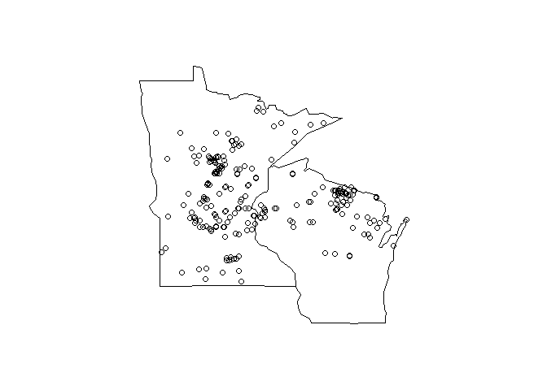

# README

Materials for manuscript describing drivers of Potamogeton species distribution in temperate lakes

## Data files

* `allmn_wq.RData` Combined legacy and recent STORET wq data for Minnesota lakes that I have aggregated across all dates, created in `storet_proc.R`

* `allwi_wq.RData` Combined legacy and recent STORET wq data for Wisconsin lakes that I have aggregated across all dates, created in `storet_proc.R`

* `legacy_wi_storet_keys.RData` spatial matches of legacy STORET stations and WBIC codes for Wisconsin, used to create wq data in `storet_proc.R`

* `mn_potam.RData` Minnesota data, frequency occurrence of potamogeton species and supporting data for each lake

* `mnmet_dat.RData` Old master dataset for Minnesota from dissertation 

* `new_wi_storet_keys.RData` spatial matches of recent STORET stations and WBIC codes for Wisconsin, used to create wq data in `storet_proc.R`

* `wi_potam.RData` Wisconsin data, frequency occurrence of potamogeton species and supporting data for each lake

* `wimet_dat.RData` Old master dataset for Wisconsin from dissertation

## Data description

Supporting data for each lake include morphometry, water quality, climate, and spatial variables:

* morphometry: lake area (km2), perimeter (km), and max depth (m)

* water quality: alkalinity (mg/L CaCO3), water colour (Pt-Co units), secchi depth (m), and phosphorous (mg/L)

* climate:  annual mean temp (C), maximum temp of warmest month (C), minimum temp of coolest month (C), precip of driest month (mm), and altitude above sea level (m)

* spatial: lat, long

## Data coverage

Not all data are complete for each dataset, mostly water quality data are missing:


```r
# MN
data(mn_potam)
dim(mn_potam)
```

```
## [1] 332  41
```

```r
dim(na.omit(mn_potam))
```

```
## [1] 146  41
```

```r
apply(mn_potam, 2, function(x) sum(is.na(x)))
```

```
##      lake  YYYYMMDD        PA        PC        PE        PF       PFL 
##         0         0         0         0         0         0         0 
##        PG        PI        PN        PO      POAL       POF      POFR 
##         0         0         0         0         0         0         0 
##       PON       POP      POPU       POR       POS      POSB      POSN 
##         0         0         0         0         0         0         0 
##       POV        PP        PR        PS        PV        PZ     depth 
##         0         0         0         0         0         0         5 
##      area     perim    secchi     color       alk        tp  Latitude 
##         0         0       133       174       158        49         1 
## Longitude     tmean      tmax      tmin      prec       alt 
##         1         1         1         1         1         1
```

```r
# WI
data(wi_potam)
dim(wi_potam)
```

```
## [1] 189  41
```

```r
dim(na.omit(wi_potam))
```

```
## [1] 29 41
```

```r
apply(wi_potam, 2, function(x) sum(is.na(x)))
```

```
##      lake  YYYYMMDD        PA        PC        PD        PE        PF 
##         0         0         0         0         0         0         0 
##        PG        PI        PN        PO      POAL       POB      POFR 
##         0         0         0         0         0         0         0 
##       PON       POO       POP      POPU       POR       POS      POSB 
##         0         0         0         0         0         0         0 
##      POSN       POV        PP        PR        PS        PZ      area 
##         0         0         0         0         0         0         0 
##     depth     perim       alk     color    secchi        TP  Latitude 
##         1         0       122       104       147       107         0 
## Longitude     tmean      tmax      tmin      prec       alt 
##         0         0         0         0         0         0
```

```r
# coverage map complete data
library(maps)
map('state', region = c('wisconsin', 'minnesota'))
points(Latitude ~ Longitude, data = na.omit(mn_potam))
points(Latitude ~ Longitude, data = na.omit(wi_potam)) 
```

 


